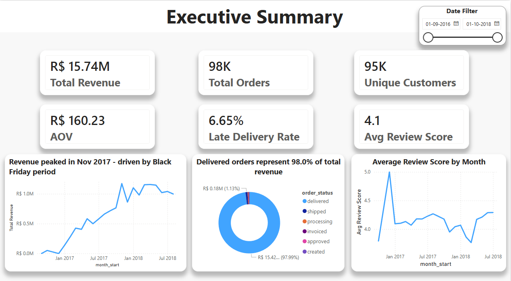
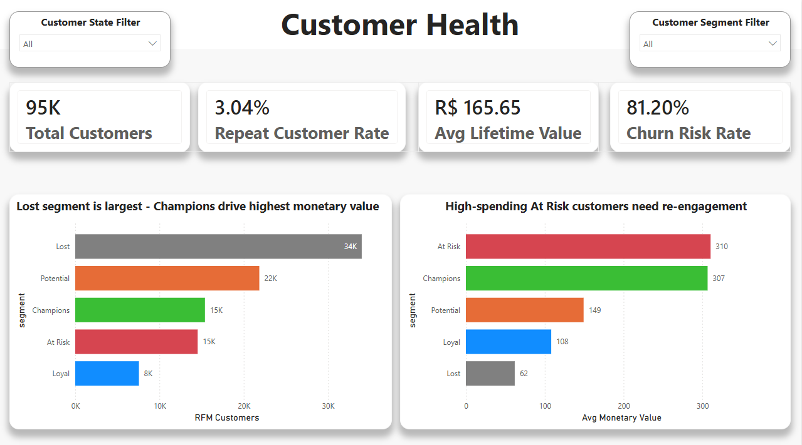
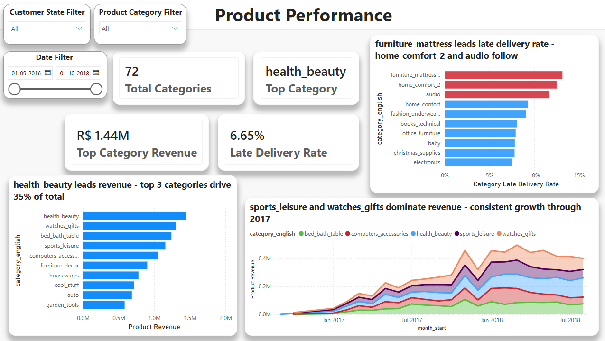
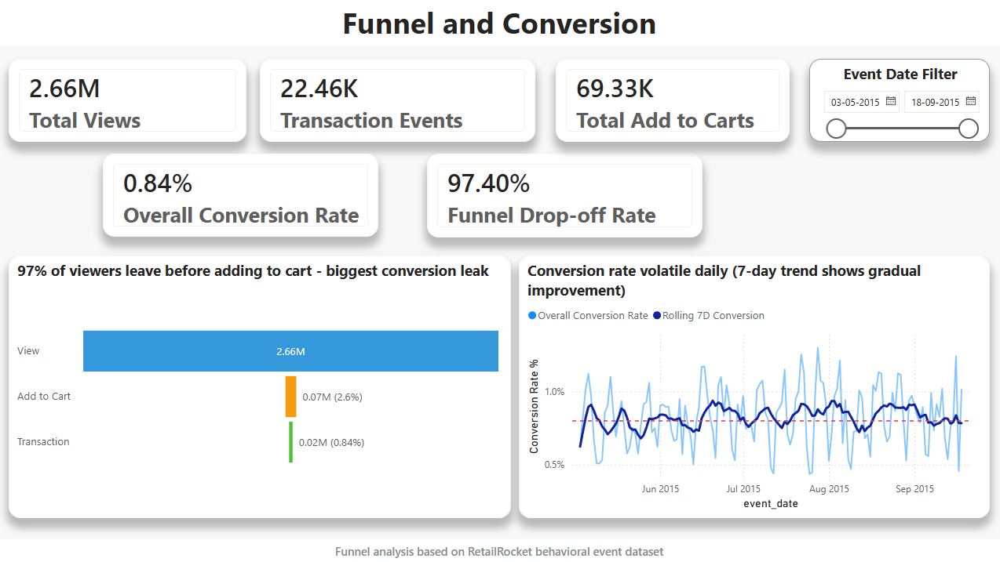
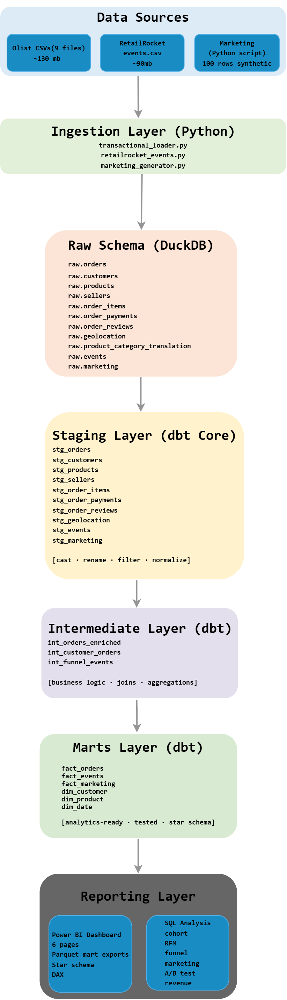
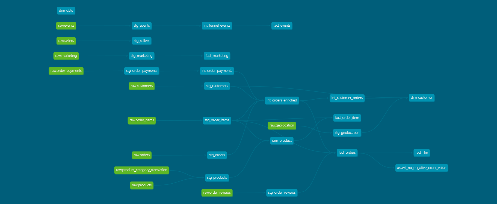
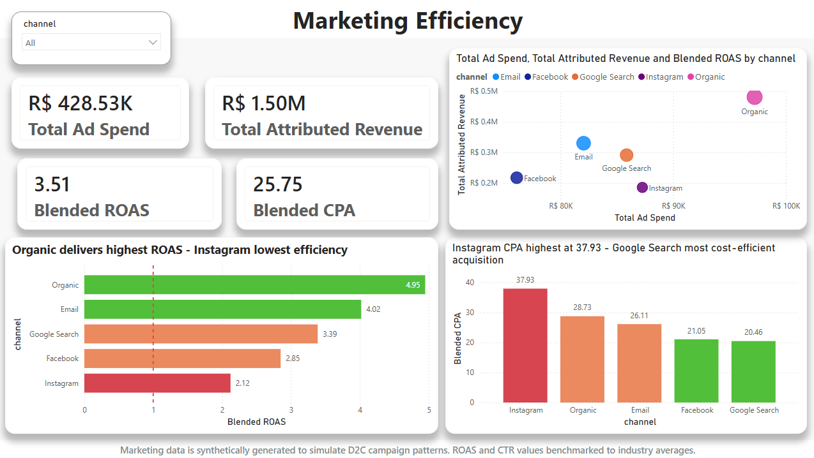
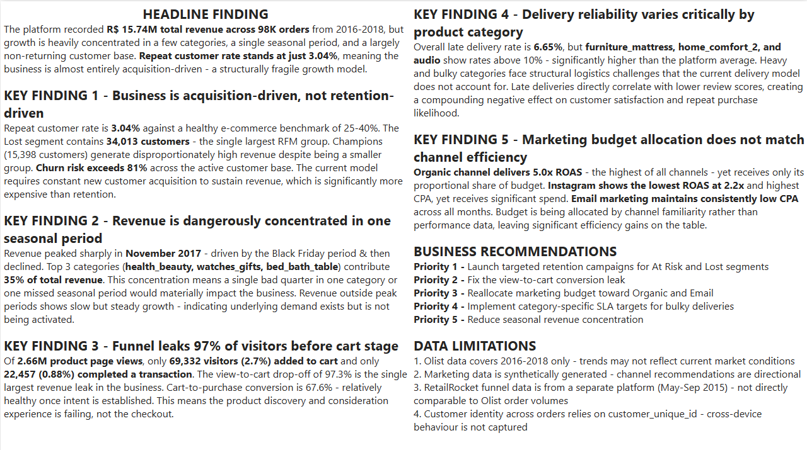

# Retail Analytics Platform

End-to-end retail analytics platform built using Python, DuckDB, dbt Core, SQL, and Power BI - covering data ingestion, warehouse modeling, advanced SQL analytics, RFM segmentation, cohort analysis, funnel analysis, and executive dashboarding.


## Dashboard Preview

| Executive Overview | Customer Health |
|---|---|
|  |  |

| Product Performance | Funnel & Conversion |
|---|---|
|  |  |

---

## Table of Contents

* [Project Overview](#project-overview)
* [Business Problem](#business-problem)
* [Project Objectives](#project-objectives)
* [Architecture Diagram](#architecture-diagram)
* [Tech Stack](#tech-stack)
* [Data Sources](#data-sources)
* [Warehouse Design](#warehouse-design)
* [dbt Modeling Layers](#dbt-modeling-layers)
* [SQL Analytics](#sql-analytics)
* [Data Quality Testing](#data-quality-testing)
* [Power BI Dashboard](#power-bi-dashboard)
* [Key Business Insights](#key-business-insights)
* [Project Structure](#project-structure)
* [Setup Instructions](#setup-instructions)
* [Documentation](#documentation)
* [Future Improvements](#future-improvements)

---

## Project Overview

This project builds a complete retail analytics platform from raw CSV files through to an executive Power BI dashboard - covering every layer of a modern analytics engineering stack.

The platform integrates three data sources:

* **Olist Brazilian E-Commerce** - 99,441 orders across 9 relational CSV files (2016–2018)
* **RetailRocket Behavioral Events** - 2.75 million clickstream events (May–Sep 2015)
* **Synthetic Marketing Data** - 100 rows of D2C channel performance data (2017–2018)

The project demonstrates:

* Production-pattern Python ingestion pipelines with idempotent loading
* Three-layer DuckDB warehouse - raw, staging, marts
* dbt Core transformations with automated schema tests
* Advanced SQL analytics - cohort retention, RFM segmentation, funnel analysis, A/B testing, marketing efficiency
* Six-page Power BI dashboard with star schema data model and DAX measures
* pytest data quality validation across raw and mart layers

---

## Business Problem

Retail businesses operating across multiple data sources - transactional, behavioral, and marketing - cannot answer critical business questions without a unified analytics layer.

This project solves that by building a centralised analytics platform that answers:

* **Revenue** - Which categories, states, and periods drive the most revenue?
* **Customers** - Are we retaining customers or constantly replacing them?
* **Products** - Which categories have delivery problems that damage satisfaction?
* **Marketing** - Which channels deliver the best return on ad spend?
* **Funnel** - Where do visitors drop off before purchasing?
* **Segmentation** - Which customers are Champions, At Risk, or already Lost?

---

## Project Objectives

* Build a modular analytics warehouse on DuckDB using a raw → staging → marts architecture
* Implement version-controlled SQL transformations using dbt Core with full lineage
* Create a star schema analytics model with tested dim and fact tables
* Perform seven advanced SQL analyses using window functions, CTEs, cohort logic, and RFM scoring
* Build a six-page executive Power BI dashboard using exported Parquet mart tables
* Validate data quality at ingestion and mart layers using pytest and dbt schema tests
* Document every data layer - raw dictionary, staging dictionary, KPI definitions, architecture

---

## Architecture Diagram



## End-to-End Pipeline Flow

Raw CSV Sources
→ Python Ingestion
→ DuckDB Raw Layer
→ dbt Staging Models
→ dbt Intermediate Models
→ dbt Mart Models
→ Parquet Mart Exports
→ Power BI Dashboard & SQL Analytics

---

## Tech Stack

| Layer | Tool | Purpose |
|---|---|---|
| Language | Python 3.11 | Ingestion scripts, data generation |
| Warehouse | DuckDB 1.5 | Local OLAP warehouse — single file, no server |
| Transformation | dbt Core 1.11 | SQL transformations, lineage, schema tests |
| dbt Adapter | dbt-duckdb | DuckDB connection for dbt |
| BI & Reporting | Power BI Desktop | Six-page executive dashboard |
| SQL Analytics | DuckDB SQL | Advanced queries - CTEs, window functions |
| Data Manipulation | pandas | DataFrame operations in ingestion |
| Testing | pytest | Data quality assertions on raw and mart tables |
| Documentation | Markdown | Data dictionaries, KPI definitions, architecture |
| Version Control | Git + GitHub | Full commit history from project start |
| SQL Editor | DBeaver Community | Visual SQL editor connected to DuckDB |

---

## Data Sources

### 1. Olist Brazilian E-Commerce Dataset
- **Source:** [Kaggle - Brazilian E-Commerce Public Dataset by Olist](https://www.kaggle.com/datasets/olistbr/brazilian-ecommerce)
- **Volume:** 99,441 orders · 9 relational CSV files · ~130 MB extracted
- **Coverage:** September 2016 - October 2018 · Brazil
- **Tables:** orders, order_items, customers, sellers, products, order_payments, order_reviews, geolocation, product_category_translation


### 2. RetailRocket Recommender System Dataset
- **Source:** [Kaggle - Retailrocket recommender system dataset](https://www.kaggle.com/datasets/retailrocket/ecommerce-dataset) by Roman Zykov
- **Volume:** 2,756,101 behavioral events · events.csv only (~90 MB)
- **Coverage:** May 2015 - September 2015
- **Events:** 2,551,374 views · 69,332 add-to-carts · 22,457 transactions

### 3. Synthetic Marketing Data
- **Source:** Generated via `ingestion/marketing_generator.py`
- **Volume:** 100 rows - 20 months × 5 channels
- **Coverage:** January 2017 - August 2018
- **Channels:** Google Search · Instagram · Facebook · Email · Organic
- **Note:** Synthetically generated with ROAS benchmarks from industry averages. In production, this connects to Google Ads API or a marketing attribution platform.

---

## Warehouse Design

The warehouse follows a three-layer ELT architecture inside a single DuckDB file.

### Schema Overview

| Schema | Purpose | Tables |
|---|---|---|
| `raw` | Exact source copy - never modified | 11 tables |
| `staging` | Cleaned, typed, renamed | 10 dbt models |
| `marts` | Analytics-ready star schema | 8 dbt models |

### Raw Layer - Row Counts

| Table | Source | Rows |
|---|---|---|
| `raw.orders` | Olist | 99,441 |
| `raw.order_items` | Olist | 112,650 |
| `raw.customers` | Olist | 99,441 |
| `raw.sellers` | Olist | 3,095 |
| `raw.products` | Olist | 32,951 |
| `raw.order_payments` | Olist | 103,886 |
| `raw.order_reviews` | Olist | 99,224 |
| `raw.geolocation` | Olist | 1,000,163 |
| `raw.product_category_translation` | Olist | 71 |
| `raw.events` | RetailRocket | 2,756,101 |
| `raw.marketing` | Synthetic | 100 |

### Mart Tables

| Table | Rows (approx) | Description |
|---|---|---|
| `marts.fact_orders` | ~96,000 | One row per order - enriched with customer, payment, review data |
| `marts.fact_events` | ~140 | Daily funnel summary - views, carts, transactions, conversion rates |
| `marts.fact_marketing` | 100 | Monthly channel performance - ROAS, CPA, CTR, conversions |
| `marts.dim_customer` | ~96,096 | One row per unique customer - uses `customer_unique_id` as key |
| `marts.dim_product` | ~32,951 | Product catalogue with English category names |
| `marts.dim_date` | ~760 | Date spine covering full Olist order date range |
| `marts.fact_rfm` | ~96,000 | RFM segmentation table with recency, frequency, monetary scores |
| `marts.fact_order_item` | ~112,650 | Order-item bridge table connecting orders and products |

> **Note on customer_id vs customer_unique_id:** Olist generates a new `customer_id`
> per order - a single person placing three orders has three different `customer_id`
> values. All customer-level analysis uses `customer_unique_id`, the stable person
> identifier. `dim_customer` uses `customer_unique_id` as its primary key.

---

## dbt Modeling Layers

### Staging Models — `models/staging/`

One model per source table. Clean, cast, rename, filter. No joins. No business logic.

| Model | Source | Key transformations |
|---|---|---|
| `stg_orders` | `raw.orders` | Timestamps cast · canceled orders filtered · `delivery_delay_days` derived |
| `stg_order_items` | `raw.order_items` | Timestamps cast · `item_total_value` derived |
| `stg_customers` | `raw.customers` | Zip INT → VARCHAR + leading zero fix · city/state normalised |
| `stg_sellers` | `raw.sellers` | Same zip and city normalisation as customers |
| `stg_products` | `raw.products` + translation | Portuguese → English category join · source typos fixed |
| `stg_order_payments` | `raw.order_payments` | `not_defined` payment type filtered |
| `stg_order_reviews` | `raw.order_reviews` | Timestamps cast · 88% null comment_title excluded |
| `stg_geolocation` | `raw.geolocation` | 1M rows → ~19K rows via `AVG(lat/lng) GROUP BY zip` |
| `stg_events` | `raw.events` | Unix ms → TIMESTAMP · columns renamed to snake_case |
| `stg_marketing` | `raw.marketing` | `campaign_month` cast to DATE |

### Intermediate Models — `models/intermediate/`

Business logic, joins, and aggregations across staging models.

| Model | Description |
|---|---|
| `int_orders_enriched` | Orders joined with customers, payments (aggregated), and items |
| `int_customer_orders` | Customer-level aggregation using `customer_unique_id` — LTV, frequency, repeat flag |
| `int_funnel_events` | Visitor-level daily funnel — views, carts, transactions, max stage reached |

### Mart Models — `models/marts/`

Analytics-ready star schema tables. Dashboard and SQL analysis reads only from here.

```
dim_date ──────────────────────────────► fact_orders (centre)
dim_customer ──────────────────────────► fact_orders
dim_product ───────────────────────────► fact_orders (via fact_order_item bridge)

fact_events    — standalone (RetailRocket)
fact_marketing — standalone (Synthetic)
```

### dbt Lineage DAG


> Generated via: `dbt docs generate && dbt docs serve`

---

## SQL Analytics

Seven advanced SQL queries in `sql/` - each answering a specific business question.

| File | Business Question | Key Techniques |
|---|---|---|
| `kpi_summary.sql` | Core business health monthly and overall | CTE · LAG · conditional aggregation |
| `cohort_retention.sql` | What % of customers return after first purchase? | DATE_TRUNC · MIN OVER · DATEDIFF · pivot |
| `rfm_segmentation.sql` | Which customers are Champions vs Lost? | NTILE(5) · composite scoring · CASE segmentation |
| `funnel_analysis.sql` | Where do visitors drop off in the purchase funnel? | UNION ALL funnel · rolling AVG OVER |
| `revenue_by_segment.sql` | Which categories and states drive revenue? | LAG MoM · RANK OVER · multi-level CTE |
| `marketing_performance.sql` | Which channels deliver best ROAS? | RANK OVER · budget vs revenue share |
| `ab_test_analysis.sql` | Is a conversion rate difference statistically real? | Z-score · pooled proportion · modulo hashing |

---

## Data Quality Testing

Two layers of automated data quality validation.

### Layer 1 - dbt Schema Tests

Declarative tests run automatically on every `dbt build`:
- `not_null` on all primary and foreign keys
- `unique` on all primary keys
- `accepted_values` on categorical columns (`order_status`, `event_type`, `payment_type`, `channel`)
- Custom singular test: no negative order values in `fact_orders`

### Layer 2 - pytest Assertions

`tests/test_data_quality.py` validates raw and mart tables directly:
- Row count thresholds (raw.orders ≥ 99,000 · fact_orders ≥ 50,000)
- Null checks on key columns (order_id, customer_unique_id, order_date)
- Range validation (review scores 1–5 · order dates 2016–2019)
- Business rule checks (transactions ≤ views · ROAS > 0 · spend > 0)
- Segment validation (all customer_segment values from defined set)

Run tests:
```bash
pytest tests/test_data_quality.py -v
```
---

## Power BI Dashboard

Six-page interactive dashboard built on analytics-ready Parquet mart exports generated from DuckDB.

**File:** `dashboard/retail_analytics_platform.pbix`

### Data Model

Hybrid star-schema analytical model with six active relationships:
- `dim_date[date_day]` → `fact_orders[order_date]` (One-to-Many)
- `dim_date[date_day]` → `fact_events[event_date]` (One-to-Many)
- `dim_customer[customer_key]` → `fact_orders[customer_unique_id]` (One-to-Many)
- `dim_customer[customer_key]` → `fact_rfm[customer_unique_id]` (One-to-One)
- `fact_order_item[product_id]` → `dim_product[product_key]` (Many-to-One)
- `fact_orders[order_id]` → `fact_order_item[order_id]` (One-to-Many)

### Dashboard Pages

#### Page 1 - Executive Summary
KPI cards: R$15.74M revenue · 98K orders · 95K customers · R$160.23 AOV · 6.65% late delivery · 4.1 avg review score.
Monthly revenue trend · order status distribution · review score trend.

#### Page 2 - Customer Health
KPI cards: 95K customers · 3.04% repeat rate · R$165.65 avg LTV · 81.20% churn risk rate.
RFM segment distribution (Lost largest at 34K · Champions at 15K) · Avg monetary value by segment.

#### Page 3 - Product Performance
KPI cards: 72 categories · health_beauty top category · R$1.44M top category revenue · 6.65% late delivery.
Top 10 categories by revenue · Late delivery rate by category (furniture_mattress highest at >10%) · Monthly revenue trend by top 5 categories.

#### Page 4 - Marketing Efficiency
KPI cards: R$428K total spend · R$1.50M attributed revenue · 3.51x blended ROAS · R$25.75 blended CPA.
ROAS by channel (Organic 4.95x highest · Instagram 2.12x lowest) · CPA comparison · Spend vs revenue scatter.
*Note: Marketing data is synthetically generated.*

#### Page 5 - Funnel and Conversion
KPI cards: 2.66M views · 22.46K transactions · 69.33K add-to-carts · 0.84% conversion rate · 97.40% drop-off rate.
Funnel visual (View → Add to Cart → Transaction) · Daily conversion rate with 7-day rolling average.
*Note: RetailRocket data - separate platform from Olist.*

#### Page 6 - Executive Insights
Headline finding · 5 key findings with quantified metrics · Business recommendations by priority · Data limitations.
No charts - pure business intelligence layer.

### Dashboard Screenshots






---

## Key Business Insights

1. **R$15.74M total revenue** generated across 98K orders - but **35% is concentrated in just 3 categories** (health_beauty, watches_gifts, bed_bath_table), creating fragility in the revenue base.

2. **Repeat customer rate is only 3.04%** - 97 in 100 customers never return. The Lost segment (34,013 customers) is the largest RFM group. At Risk customers have the highest average spend (R$310) making them the highest-ROI re-engagement target.

3. **97.4% of visitors drop off before adding to cart** - of 2.66M product page views, only 69,332 reached the cart and 22,457 completed a transaction (0.84% overall conversion). The biggest leak is at the discovery stage, not checkout.

4. **Late delivery rate is 6.65% overall** but furniture_mattress, home_comfort_2, and audio categories exceed 10% - creating compounding customer satisfaction damage in high-volume categories.

5. **Organic delivers 4.95x ROAS** - highest of all channels. Instagram delivers 2.12x ROAS at the highest CPA (R$37.93). Budget is not aligned with channel performance - reallocating from Instagram toward Email and Organic improves blended efficiency immediately.

---

## Project Structure

```
retail-analytics-platform/                   
│
├── dashboard/
│   ├── retail_analytics_platform.pbix 
│   └── screenshots/                   
│
├── data/
│   ├── raw/
│   │   ├── olist/                     
│   │   ├── retailrocket/              
│   │   └── marketing_data.csv         
│   └── processed/
│       └── marts/                         
│        
├── dbt/
│   └── retail_analytics/
│       ├── models/
│       │   ├── staging/             
│       │   ├── intermediate/          
│       │   └── marts/               
│       ├── tests/                    
│       └── dbt_project.yml
│
├── docs/
│   ├── initial_observation.md
│   ├── raw_data_dictionary.md
│   ├── marts_data_dictionary.md      
│   ├── staging_data_dictionary.md     
│   ├── kpi_definitions.md           
│   └── problem_statement.md      
│
├── ingestion/
│   ├── transactional_loader.py       
│   ├── retailrocket_events.py        
│   └── marketing_generator.py      
│
├── notebooks/                        
│   ├── eda_behavioral_events.ipynb                  
│   ├── eda_transactional.ipynb
│   ├── marketing_analysis.ipynb
│   └── rfm_profiling.ipynb
│
├── reports/
│   └── executive_summary.md          
│
├── scripts/
│   └── export_to_parquet.py
│
├── sql/
│   ├── kpi_summary.sql
│   ├── cohort_retention.sql
│   ├── rfm_segmentation.sql
│   ├── funnel_analysis.sql
│   ├── revenue_by_segment.sql
│   ├── marketing_performance.sql
│   ├── ab_test_analysis.sql
│   └── README.md                     
│
├── tests/
│   ├── verify_raw.py                  
│   ├── profile_raw.py         
│   └── test_data_quality.py           
│
├── warehouse/
│   ├── setup_warehouse.py           
│   └── retail_warehouse.db           
│
├── .env                              
├── .gitignore
├── requirements.txt
└── README.md
```

---

## Setup Instructions

### Prerequisites
- Python 3.10 or higher
- Git
- Power BI Desktop (for dashboard)
- DBeaver Community (optional - for visual SQL browsing)
- Kaggle account (for dataset download)

### 1 - Clone Repository

```bash
git clone https://github.com/Chandansahu18/retail-analytics-platform.git
cd retail-analytics-platform
```

### 2 - Create and Activate Virtual Environment

```bash
python -m venv venv

# Windows
venv\Scripts\activate

# Mac/Linux
source venv/bin/activate
```

### 3 - Install Dependencies

```bash
pip install -r requirements.txt
```

### 4 - Configure Environment Variables

Create `.env` in the project root:

```env
DB_PATH=warehouse\retail_warehouse.db
EVENTS_PATH=data/raw/retailrocket/events.csv
OLIST_PATH=data\raw\olist
```

### 5 - Download Source Data

Download the following from Kaggle and place as shown:

| Dataset | Kaggle URL | Destination |
|---|---|---|
| Olist Brazilian E-Commerce | [Link](https://www.kaggle.com/datasets/olistbr/brazilian-ecommerce) | `data/raw/olist/` (all 9 CSV files) |
| RetailRocket Dataset | [Link](https://www.kaggle.com/datasets/retailrocket/ecommerce-dataset) | `data/raw/retailrocket/events.csv` only |

### 6 - Run Ingestion Pipeline

```bash
# Create DuckDB warehouse and schemas
python warehouse/setup_warehouse.py

# Load Olist source tables
python ingestion/transactional_loader.py

# Load RetailRocket behavioral events
python ingestion/retailrocket_events.py

# Generate and load synthetic marketing data
python ingestion/marketing_generator.py

# Validate raw layer row counts
python tests/verify_raw.py
```

### 7 - Configure dbt Profile

Add to `~/.dbt/profiles.yml`:

```yaml
retail_analytics:
  target: dev
  outputs:
    dev:
      type: duckdb
      path: C:/retail-analytics-platform/warehouse/retail_warehouse.db
      threads: 4
```

### 8 - Run dbt Transformation Pipeline

```bash
cd dbt/retail_analytics

# Verify connection
dbt debug

# Run all models and tests
dbt build

# Explore lineage
dbt docs generate
dbt docs serve
```

### 9 - Run Data Quality Tests

```bash
cd C:/retail-analytics-platform
pytest tests/test_data_quality.py -v
```

### 10 - Export Mart Tables to Parquet

Run the export pipeline to create analytics-ready Parquet files for Power BI:

```bash
python scripts/export_to_parquet.py
```

This exports the following mart tables to:

```text
data/processed/marts/
```

Exported files:
- `fact_orders.parquet`
- `fact_events.parquet`
- `fact_marketing.parquet`
- `fact_rfm.parquet`
- `fact_order_item.parquet`
- `dim_customer.parquet`
- `dim_product.parquet`
- `dim_date.parquet`

---

### 11 - Open Power BI Dashboard

1. Open `dashboard/retail_analytics_platform.pbix`
2. Power BI reads data from:
   ```text
   data/processed/marts/
   ```
3. Refresh data if prompted


---

## Documentation

| Document | Description |
|---|---|
| [`docs/raw_data_dictionary.md`](docs/raw_data_dictionary.md) | All 11 raw source tables - columns, types, null counts, data quality notes |
| [`docs/staging_data_dictionary.md`](docs/staging_data_dictionary.md) | All 10 staging models - transformation tags, what changed from raw |
| [`docs/kpi_definitions.md`](docs/kpi_definitions.md) | Every KPI with precise formula and source table |
| [`docs/marts_data_dictionary.md`](docs/marts_data_dictionary.md) | Final mart tables - business-ready metrics and dimensional models |
| [`reports/executive_summary.md`](reports/executive_summary.md) | Non-technical business findings and recommendations |


---

## Phase Completion

| Phase | Description | Status |
|---|---|---|
| Phase 1 | Data Ingestion - folder structure, venv, DuckDB raw layer | ✅ Complete |
| Phase 2 | dbt Transformation - staging, intermediate, mart models | ✅ Complete |
| Phase 3 | SQL Analytics - 7 advanced queries | ✅ Complete |
| Phase 4 | Python EDA - pandas, seaborn, notebooks | ✅ Complete |
| Phase 5 | Power BI Dashboard - 6-page dashboard | ✅ Complete |
| Phase 6 | Reporting and Production Hardening - pytest, docs | ✅ Complete |

---

## Future Improvements

* Connect ingestion to live APIs - Google Ads API, Shopify webhooks
* Add Airflow DAGs for scheduled pipeline execution
* Migrate warehouse from DuckDB to BigQuery or Snowflake for multi-user access
* Deploy Power BI dashboard to Power BI Service with scheduled refresh
* Add incremental dbt models for large table efficiency
* Add Docker containerization for portable environment setup
* Implement Great Expectations as an additional validation layer
* Add geospatial analysis using customer lat/long from geolocation table
